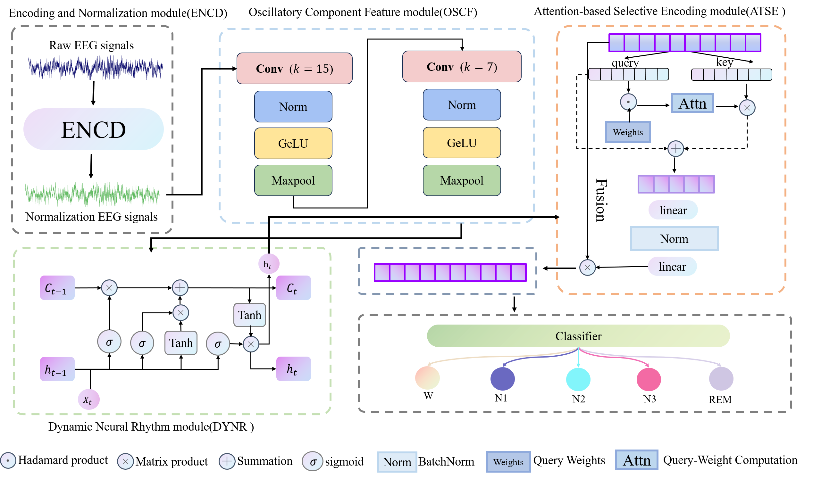

# NeuroSleep
### NeuroSleep: A Physiologically and Neuro-Inspired Framework for Robust EEG-Based Sleep Staging
## Abstract

Accurate and automated sleep staging using electroencephalogram (EEG) signals plays a vital role in the diagnosis and management of sleep disorders. However, existing methods are often challenged by sensitivity to multi-source noise, difficulty in modeling temporal transitions, and severe class imbalance. To address these issues, we propose NeuroSleep, a modular and neurophysiologically inspired deep learning framework for robust EEG-based sleep staging. NeuroSleep integrates five key components: (1) an Encoding and Normalization (ENCD) module to mitigate inter-subject amplitude variability; (2) an Oscillatory Component Feature (OSCF) extractor utilizing multi-scale CNNs to capture frequency-specific information; (3) a Dynamic Neural Rhythm (DYNR) module employing LSTM networks for temporal modeling; (4) an Attention-based Selective Encoding (ATSE) mechanism to emphasize salient EEG events such as sleep spindles and K-complexes; and (5) a Physiological Rule-Guided Loss (REGL) function incorporating sleep-specific spectral constraints. Extensive experiments on three public datasets (Sleep-EDF-20, Sleep-EDF-78, and SHHS) demonstrate that NeuroSleep outperforms several state-of-the-art approaches, achieving superior accuracy, macro-F1, and kappa scores. These results highlight the framework’s effectiveness and potential for clinical deployment.

## Requirmenets:
- Python 3.11
- Pytorch=='1.8'
- Numpy
- Sklearn
- mne=='0.20.7'

## Prepare datasets

We used three public datasets in this study:
Sleep-EDF-20(https://physionet.org/content/sleep-edfx/1.0.0/)
Sleep-EDF-78(https://physionet.org/content/sleep-edfx/1.0.0/)
SHHS dataset(https://sleepdata.org/datasets/shhs)

